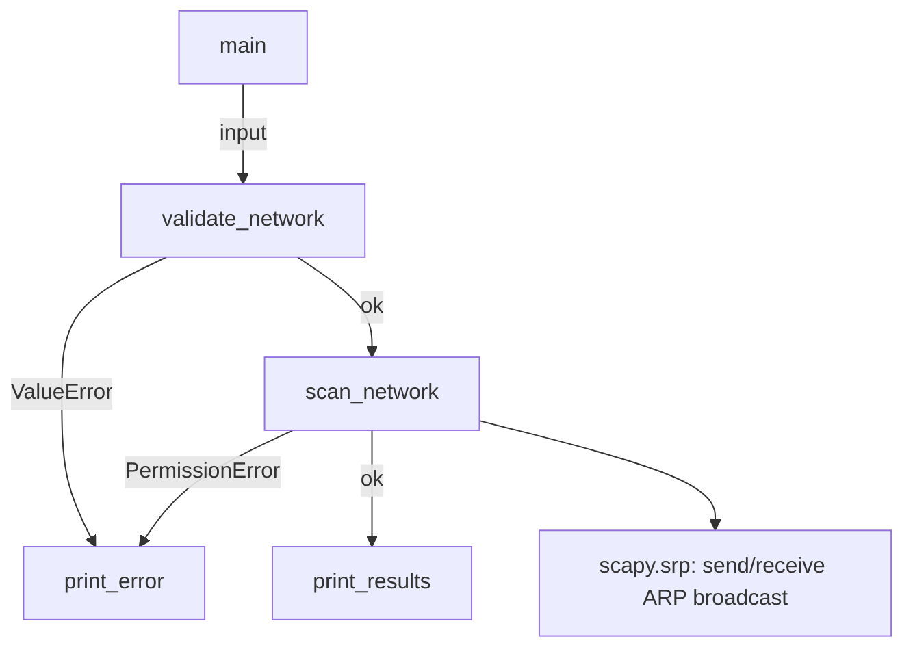
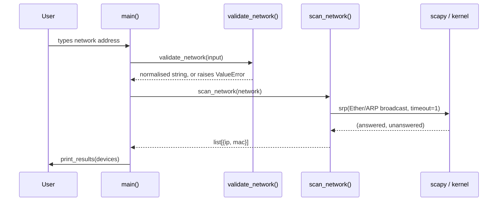

# Network-Hunter: Technical & Product Roadmap

*A reverse-engineering pass on the current codebase, followed by a capability
and product roadmap for evolving it from a single-file ARP scanner into a
full network discovery/security platform. All ranking calls (impact, effort,
complexity) are judgment calls meant to guide prioritization discussions, not
committed estimates.*

---

## Phase 1 — Reverse Engineering

### Architecture (as of today)

A single 168-line module (`main.py`), four functions, no classes, no
persistence, no configuration file, no CLI arguments. Everything is driven
by one interactive `input()` prompt.

### Execution flow

One synchronous call, one broadcast domain, one fixed 1-second window,
process exits when it's done. No loop, no daemon mode, no scheduling.

### Dependencies

| Package | Role | Notes |
|---|---|---|
| `scapy` | Packet construction, raw send/receive (`srp`) | Needs raw-socket access (root / `CAP_NET_RAW` on Linux, Npcap on Windows) |
| `rich` | Colourised error output | Presentation only |
| `ipaddress` (stdlib) | CIDR validation | No network access |

No async runtime, no database driver, no web framework — this is a pure CLI
utility today.

### Network protocols in use

- **ARP** (RFC 826) request/reply only — no IPv6 (NDP is the IPv6
  equivalent and isn't implemented; this tool is IPv4-only today).
- **Ethernet** L2 broadcast (`ff:ff:ff:ff:ff:ff`) to carry the ARP frames.
- No L3+ protocols at all — no ICMP, no TCP/UDP probing, no DNS.

### OS assumptions

- Assumes a POSIX-like raw-socket model (Linux `AF_PACKET`/BPF). On
  Windows, scapy requires **Npcap** to be installed separately — this isn't
  mentioned anywhere in the README, and would be the very first thing a
  Windows user trips over.
- Assumes the operator can freely become root (`sudo`). No support for
  Linux capabilities (`setcap cap_net_raw+ep`) to avoid running as root
  outright, which is both a UX and a security improvement opportunity (see
  Phase 4).
- Assumes a single active interface reachable by the OS's default routing
  table; there's no `-i`/interface selection, so on a multi-homed host
  (VPN + LAN, multiple NICs) the scan may go out an unintended interface.

### Performance limitations

- **Single fixed 1-second timeout** covers the *entire* scan regardless of
  target size. A `/24` (254 hosts) and a `/16` (65k hosts) get the same
  window — the `/16` will silently under-report almost everything, since
  `srp()`'s timeout is a single global wait, not per-host.
- **Fully synchronous** — one process, one blocking call. No concurrency,
  no batching, no streaming of results as they arrive (nothing is printed
  until the entire scan completes).
- **No retry/backoff.** A single lost broadcast reply (common on Wi-Fi,
  or with switches that rate-limit broadcast storms) means a missed host,
  with no second attempt.
- **No result caching or delta detection** — every run starts from zero
  context; there's no "what changed since last time."

### Security implications

- Sending unsolicited L2 broadcasts across an entire subnet is completely
  normal for a network admin tool, but on a monitored network it can
  trigger IDS/NAC alerts (ARP sweep = a classic recon signature). There's
  no way to throttle, jitter, or scope the sweep to reduce that signature
  — worth calling out explicitly in the README as an operational
  consideration, not just a technical one.
- The tool requires root for the entire process lifetime, when only the
  packet send/receive actually needs elevated privileges. There's no
  privilege-drop step after socket creation — a decent hardening target
  once the codebase is more than one file.
- No audit logging of what was scanned, when, or by whom — fine for a
  personal utility, a real problem the moment this is used in any
  environment with change-control or compliance requirements (see Phase 4
  / Phase 3 "Compliance").

### Scalability limitations

- No persistence layer at all — results live and die in a single
  process's memory. There's no way to compare "today's scan" against
  "yesterday's scan," which is the foundation almost every feature in
  Phases 2–6 depends on.
- No concept of multiple networks/sites, scheduling, or distributed
  scanning (e.g. a lightweight agent per site reporting to a central
  collector) — everything assumes one operator, one interactive run, one
  local subnet.

### Code quality issues / technical debt

Already addressed in the last review pass (input validation, error
handling, test coverage). What's left, roughly in order of what unblocks
the most future work:

1. **No `argparse`/CLI flags.** Everything goes through a blocking
   `input()` call, which makes the tool impossible to script, cron, or
   run non-interactively — a hard blocker for almost every Phase 3–5 item
   (scheduled scans, CI-triggered scans, MSP automation).
2. **No structured logging** (just `print`) — fine for a CLI toy, a
   liability for anything meant to run unattended.
3. **No data model beyond a bare `dict`** (`{"ip": ..., "mac": ...}`) —
   the moment enrichment fields show up (vendor, hostname, open ports,
   first-seen/last-seen timestamps), this needs a real `dataclass`/model
   and a versioned schema.
4. **Tight coupling of I/O and orchestration in `main()`** — acceptable
   at 45 lines of logic, but the natural seam to introduce a `Scanner`
   class / plugin architecture before more discovery methods (Phase 2)
   get bolted on.
5. **Single-file module.** Fine today; the moment enrichment, storage, and
   a web UI show up, this needs to become a package
   (`network_hunter/{scan,enrich,storage,cli,web}.py`).

---

## Phase 2 — Capability Discovery

*What's available from an ARP sweep alone, or with one small addition,
that isn't being used yet.*

| Capability | Value it adds | Complexity | Effort | New dependencies |
|---|---|---|---|---|
| **MAC vendor / OUI lookup** | Turns a bare MAC into a manufacturer name ("Apple, Inc.", "Raspberry Pi Foundation") — the single highest-value/lowest-effort enrichment available. Immediately makes results human-readable. | Low | ~1 day | A local OUI table (IEEE's public `oui.txt`, or the `manuf` file scapy already ships with) — no network call needed |
| **Reverse DNS / mDNS hostnames** | "192.168.1.23" becomes "kitchen-printer.local" — the second highest-value enrichment. mDNS (`.local`) catches devices rDNS won't (most consumer IoT). | Low–Medium | 2–3 days | `dnspython` for rDNS; `zeroconf` for mDNS |
| **Duplicate IP / ARP anomaly detection** | Flags two different MACs claiming the same IP within one sweep — the core signal behind both "misconfigured DHCP" and "ARP spoofing in progress." Nearly free once results are stored as a list rather than immediately printed. | Low | 1–2 days | None (pure logic on already-collected data) |
| **Device classification (heuristic)** | Combines OUI + hostname pattern + (optionally) open ports into a rough category: router, printer, IoT, phone, server, unknown. Immediately more useful in a report than a flat IP/MAC table. | Medium | 3–5 days | Depends on which signals feed it (OUI alone is a good v1) |
| **Rogue / new-device detection** | Requires persistence (Phase 1 gap): diff today's scan against a stored baseline and flag anything not seen before. This is the single feature that turns the tool from "a scanner" into "a monitor." | Medium | 3–5 days (mostly the storage layer) | A local DB (SQLite is enough to start) |
| **Passive monitoring (sniff mode)** | Instead of actively probing, just listen for ARP/DHCP/mDNS traffic already on the wire. Zero network footprint (no broadcast signature), and catches devices that ignore/rate-limit ARP requests but still chatter naturally. | Medium | 3–5 days | None beyond scapy's `sniff()` |
| **DHCP correlation** | Sniffing `DHCPDISCOVER`/`DHCPREQUEST`/`DHCPACK` traffic ties a MAC to the hostname it *announced itself* (DHCP option 12), which is often more trustworthy than rDNS. | Medium | 3–5 days | None beyond scapy |
| **VLAN awareness** | On a trunked interface, inspect/set 802.1Q tags to scan multiple VLANs from one host instead of needing a NIC per VLAN. Real value for anyone managing more than a flat network. | Medium–High | 1–2 weeks | None beyond scapy (`Dot1Q` layer); needs a trunk port to test against |
| **Network fingerprinting (OS guess)** | A lightweight p0f-style guess from TTL + a couple of well-known ports, without a full Nmap-style OS-detection engine. Rougher than Nmap, but zero new heavy dependency. | Medium–High | 1–2 weeks | None beyond scapy for the TTL/probe side |

---

## Phase 3 — Expansion Brainstorm

*Assuming no resource constraints — everything realistic that could exist
in an "Enterprise Network Discovery Platform" built on this foundation.*

**Discovery**
- Multi-subnet / multi-VLAN sweeps in one run
- IPv6 neighbor discovery (NDP) alongside ARP
- Passive + active hybrid mode (listen first, only actively probe gaps)
- Scheduled/continuous discovery (daemon mode, not just one-shot)
- Multi-site agents reporting to a central collector

**Inventory**
- Persistent asset database (SQLite → Postgres as it grows)
- First-seen / last-seen / uptime-percentage per device
- Asset tagging, ownership, location, criticality metadata
- Import/export (CSV, CMDB sync)

**Security**
- ARP spoofing / MITM detection (see Phase 4)
- Rogue device & rogue AP detection
- MAC spoofing detection (vendor OUI vs. claimed hostname mismatch, MAC
  randomization detection)
- Unauthorized-device alerting (Slack/email/webhook on new/unknown MAC)

**Monitoring**
- Continuous drift detection ("what changed since last scan")
- Device up/down / flapping detection
- Historical trend dashboards (device count over time, churn rate)
- SLA-style uptime tracking for critical infra (gateway, DNS server)

**Automation**
- Scheduled scans via cron/systemd timer, or a built-in scheduler
- Webhook/API triggers ("scan now" from CI/CD or ticketing systems)
- Auto-remediation hooks (e.g. auto-quarantine VLAN move on rogue device —
  requires switch integration, see Phase 5)

**Reporting**
- Scheduled PDF/HTML summary reports (daily/weekly network health)
- Diff reports ("3 new devices, 1 missing since last week")
- Exportable inventory (CSV/JSON/Excel)

**Visualization**
- Web dashboard (device list, filters, search)
- Network topology graph (see Phase 5 — LLDP/CDP make this real, not
  guessed)
- Heatmap of device density by subnet/VLAN

**Asset Management**
- CMDB-style records per device (owner, department, purchase date)
- Lifecycle tracking (new → active → stale → decommissioned)
- License/warranty tracking integration

**Compliance**
- Audit trail of every scan (who, when, what was found)
- Evidence export for audits (SOC 2, ISO 27001 asset-inventory controls)
- Policy checks ("all devices must be in the asset DB" / "no unmanaged
  devices in the server VLAN")

**Threat Hunting**
- Baseline deviation alerts (new open port on a known device, new device
  in a sensitive VLAN)
- Correlation with threat-intel feeds (known-malicious MAC OUI blocks,
  known IoT botnet device signatures)
- Lateral-movement indicators (unexpected east-west ARP traffic patterns)

**Wireless**
- Wireless AP/SSID discovery via monitor-mode sniffing
- Rogue AP detection (SSID spoofing, evil-twin detection)
- Client-to-AP association mapping

**Cloud**
- Cross-reference discovered on-prem devices against cloud asset
  inventories (AWS/Azure/GCP resource lists) to catch shadow IT that
  *isn't* in the cloud console but *is* talking to cloud endpoints
- VPC/subnet-aware scanning for cloud-hosted virtual networks

**Container**
- Container/pod network discovery inside a Kubernetes cluster (via the
  CNI's own APIs, not ARP — ARP doesn't meaningfully exist inside most
  overlay networks)
- Service-mesh-aware topology (what talks to what, at the container level)

**Enterprise Integration**
- SIEM export (Splunk HEC, Elastic, Syslog/CEF)
- ServiceNow/Jira ticket auto-creation on rogue device detection
- SSO (SAML/OIDC) for a web UI, RBAC for multi-team use

**AI Features**
- Anomaly scoring on traffic/behavior patterns (flag "this device usually
  talks to 3 hosts, now it's talking to 300")
- Natural-language query over the inventory ("show me every unmanaged
  device in the guest VLAN")
- Auto-classification of unknown devices from behavioral fingerprints
  when OUI/hostname signals are absent or spoofed

---

## Phase 4 — Security Roadmap

Ranked by **impact** (how much this actually reduces risk / catches real
incidents), with engineering effort and day-to-day operational value
called out separately, since a feature can be high-impact but low
day-to-day usefulness (or vice versa).

| # | Feature | Impact | Eng. Effort | Operational Value | Why |
|---|---|---|---|---|---|
| 1 | **ARP spoofing / MITM detection** | High | Medium | High | Passively watch for one IP resolving to multiple MACs in a short window — the classic MITM/ARP-poisoning signature. Directly protects users, not just informs them. |
| 2 | **Rogue device detection** | High | Medium | High | Requires the baseline/persistence work from Phase 2, but once that exists this is close to free, and it's the feature every NOC/security team actually wants day one. |
| 3 | **Unauthorized AP / rogue AP detection** | High | High | High | Needs monitor-mode wireless capture (new capability class entirely — see Phase 3/Wireless), but evil-twin and rogue-AP attacks are a top real-world vector this tool doesn't touch today. |
| 4 | **MAC spoofing detection** | Medium | Low–Medium | Medium | OUI-vs-claimed-hostname mismatches and MAC randomization patterns are useful signal but noisier than ARP spoofing (many legitimate devices randomize MACs by design, e.g. modern phones on Wi-Fi). |
| 5 | **Network drift detection** | Medium | Low (once baseline/persistence exists) | High | Not glamorous, but "tell me what changed" is the single most-used feature of every commercial NDR/asset tool. Cheap once storage exists. |
| 6 | **Duplicate IP detection** | Medium | Low | Medium | Mostly catches misconfiguration (two static IPs colliding) rather than malice, but it's a real, common, easy win. |
| 7 | **Shadow IT discovery** | Medium | Medium | High (for security/compliance teams specifically) | Cross-referencing discovered devices against an approved-asset list surfaces exactly what compliance audits ask for. |
| 8 | **Unauthorized switch detection** | Medium | High | Medium | Needs LLDP/CDP (Phase 5) to distinguish "a switch showed up" from "a device showed up" — meaningfully harder than host-level rogue detection. |
| 9 | **Lateral movement indicators** | Medium | High | Medium (High for mature SOCs) | Needs sustained traffic-pattern data, not a point-in-time scan — this is closer to a Zeek/NDR feature than an ARP-scanner feature, and probably shouldn't be built from scratch rather than integrated. |
| 10 | **Vulnerability correlation** | Low–Medium (as built here) | High | Medium | Cross-referencing discovered device fingerprints against CVE feeds sounds great, but fingerprint accuracy (Phase 2's OS-guessing) has to be solid first, or this just produces noisy false positives. |
| 11 | **NAC-style enforcement** (auto-quarantine, port shutdown) | High *if it works*, High *risk if it doesn't* | Very High | High for MSPs/NOCs, but genuinely dangerous to get wrong | This crosses from "discovery tool" into "actively changes network state" — needs switch API integration (Phase 5), strong safeguards, and almost certainly a manual-approval step before any auto-action, given the blast radius of a bad automated port shutdown. |

**Suggested sequencing:** 5 → 6 → 2 → 1 → 4 → 7, then 3/8/9/10, with 11
treated as a separate, much later, opt-in product surface rather than a
core feature — the risk profile is different enough (this actively
changes network state) that it deserves its own safety review, not just a
line item.

---

## Phase 5 — Network Engineering Roadmap

*For Network Engineers, Security Engineers, NOC teams, MSPs, and
datacenter operators — the discovery methods that go beyond "is this IP
alive" into "what is the actual physical/logical network."*

| Feature | How it would actually be implemented |
|---|---|
| **LLDP discovery** | Passively sniff (`scapy.sniff`) for LLDP frames (EtherType `0x88cc`) on the wire — every LLDP-enabled switch/AP announces itself every ~30s. No active probing needed; this is free signal once a sniff-mode listener exists (Phase 2). |
| **CDP discovery** | Same pattern as LLDP but Cisco's proprietary protocol (multicast to `01:00:0c:cc:cc:cc`, SNAP-encapsulated). Scapy has a `CDPMsg` layer; parse vendor/platform/port-ID fields the same way. |
| **SNMP polling** | Use `pysnmp` (or the lighter `easysnmp`) to poll standard MIBs (`IF-MIB` for interfaces, `BRIDGE-MIB` for the switch's MAC address table, `LLDP-MIB`/`CISCO-CDP-MIB` as an active alternative to passive sniffing) against devices that answer on UDP/161. This is what turns "I saw a MAC" into "I know which switch port that MAC is plugged into." |
| **Device (config) backup** | For SNMP-writable or SSH-accessible devices, scheduled `show running-config` (via `netmiko`/`napalm`) pulls and diffs, stored with version history — standard NOC hygiene, and a natural fit once the tool already knows every device's IP and vendor (from OUI/SNMP `sysDescr`). |
| **Topology mapping** | Combine LLDP/CDP neighbor tables (who's plugged into whom) with SNMP interface data into a graph (`networkx`), rendered via Graphviz/D3 in the web UI (Phase 3/Visualization). This is where "guessed" topology (ARP-only) becomes *actual, verified* topology. |
| **Switch port identification** | Correlate a host's MAC (from ARP) against the switch's `BRIDGE-MIB` forwarding table (via SNMP) to answer "which physical switch port is this device plugged into" — the single most-requested NOC feature for troubleshooting ("where is this laptop physically connected"). |
| **Interface statistics** | Poll `IF-MIB::ifInOctets`/`ifOutOctets`/`ifOperStatus` etc. on a schedule, store as a time series (even SQLite with a timestamp column works for v1; move to a real TSDB like Prometheus/InfluxDB once volume justifies it). |
| **STP analysis** | Poll `BRIDGE-MIB`/`STP-MIB` (or vendor-specific MIBs) to surface root bridge, blocked ports, and topology-change counts — mostly a diagnostic/health feature for spotting loops or unstable topology. |
| **VLAN mapping** | Combine 802.1Q tag inspection (Phase 2) with SNMP `Q-BRIDGE-MIB` to build a per-switch, per-port VLAN membership map — answers "what VLAN is port 14 on switch 3 actually in" without needing to log into the switch. |
| **PoE inventory** | Poll `POWER-ETHERNET-MIB` for per-port power draw/class — useful for capacity planning (how much PoE budget is left on a switch) and for spotting unexpected devices (a port suddenly drawing PoE that shouldn't be). |
| **Wireless controller integration** | Poll the vendor's controller API (Cisco WLC, Aruba, UniFi, Meraki all have REST or SNMP APIs) for AP inventory and client-association data — the wireless equivalent of switch port ID: "which AP and which SSID is this client actually on." |

**A note on sequencing here:** LLDP/CDP passive discovery is the natural
next step after Phase 2's sniff-mode work (same mechanism, different
EtherType) and delivers real topology data almost for free. SNMP polling
is the bigger lift — it's a new protocol, needs credential management
(community strings / SNMPv3 auth), and needs per-vendor MIB handling —
but it's also the single dependency that unlocks the *majority* of this
phase (port ID, interface stats, STP, VLAN mapping, PoE). Prioritizing
SNMP support early, even minimally (read-only, a handful of standard
MIBs), pays for itself across several features at once.

---

## Phase 6 — Data Enrichment

*What each additional data source contributes, and why it makes the
scanner more useful — not just "more data" for its own sake.*

| Enrichment | Source | What it adds | Why it matters |
|---|---|---|---|
| **MAC vendor (OUI)** | Local IEEE OUI table | Manufacturer name | Turns an opaque MAC into a recognizable device type at a glance — the highest value-per-effort item in this entire roadmap. |
| **Hostname (rDNS)** | PTR record lookup | Human-readable name | Most useful on managed networks with real DNS; near-useless on consumer/guest networks where nothing registers a PTR record. |
| **DNS records (forward/other)** | Standard DNS queries | Confirms whether a discovered IP matches what DNS *expects* to be there | Mismatches are a signal (stale DNS, or something impersonating a known hostname's IP). |
| **NetBIOS name** | NBNS query (UDP/137) | Windows machine name, without needing DNS | Catches Windows hosts on networks where DNS registration is inconsistent (very common on SMB/consumer networks). |
| **mDNS (`.local`)** | Multicast DNS query | Apple/IoT-friendly hostnames and service records (`_airplay._tcp`, `_ipp._tcp`, etc.) | Often the *only* naming signal available for phones, smart-home devices, and printers that never touch traditional DNS or NetBIOS. |
| **LLMNR** | Link-local multicast query | Fallback Windows hostname resolution | Marginal beyond NetBIOS/mDNS today, but cheap to add once the multicast-listening infrastructure for mDNS exists, and it's one more identity signal for Windows-heavy networks. |
| **SNMP `sysDescr`/`sysName`** | SNMP GET | Vendor + model + often OS version, directly from the device itself | The single most *reliable* identity source of everything in this table — it's the device self-reporting, not an inference — but only works on devices with SNMP enabled (mostly infra: switches, printers, UPSs, not laptops/phones). |
| **Open ports** | Lightweight TCP connect/SYN probe on a small well-known set | Service surface (22=SSH, 80/443=web admin, 9100=printer, 3389=RDP…) | Strong device-role signal (a host with 9100 open is almost certainly a printer) and a basic exposure check ("why does this IoT device have 23/telnet open"). |
| **OS guess (TTL/fingerprint)** | Passive TTL inspection, or active fingerbank-style probing | Rough OS family | Cheap version (TTL bucket: ~64=Linux/macOS, ~128=Windows, ~255=network gear) is nearly free and good enough for device classification; a full Nmap-style active fingerprint is a much bigger, separate feature. |
| **Service detection (banner grab)** | Connect to an open port, read the banner | Software/version behind a port, not just "port is open" | Turns "port 22 open" into "OpenSSH 8.2 on Ubuntu" — meaningfully better for both inventory and vulnerability correlation (Phase 4 #10). |
| **Device role classification** | Combines *all* of the above (OUI + hostname pattern + open ports + SNMP `sysDescr`) | A single human label: router / switch / printer / phone / IoT / server / workstation / unknown | This is the payoff enrichment — every prior signal on its own is a clue; combined, they're what makes an inventory report actually readable by someone who isn't staring at raw IP/MAC pairs. |

**Sequencing note:** OUI lookup and open-port scanning are both cheap,
local (or near-local), and don't need new listening infrastructure — do
those first. mDNS/NetBIOS/LLMNR all share the same "listen on a multicast
address" pattern as the passive ARP/LLDP/CDP sniffing already planned in
Phases 2 and 5, so bundling them into one passive-discovery subsystem
(rather than four separate one-off scripts) is the efficient path.
SNMP `sysDescr` is the highest-*trust* signal in this table but requires
credentials and only covers infrastructure devices — good as a
complement to, not a replacement for, the passive/OUI signals that cover
everything else.
